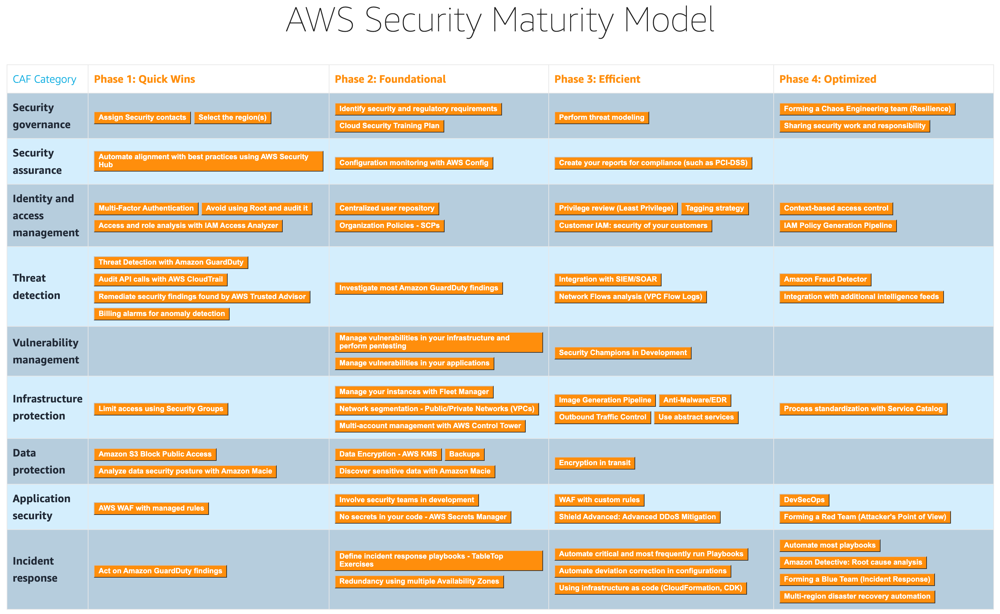
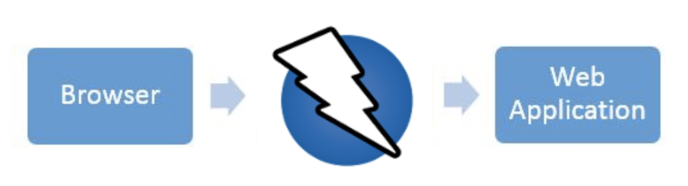

# Introduction

# Security Standards

## AWS Security Maturity Model

Materials can be found [here](https://maturitymodel.security.aws.dev/en/model/).

# Security Tools

## Mobile

- [MOBSF](https://mobsf.github.io/Mobile-Security-Framework-MobSF/)
  

## DAST

- [Zap](https://www.zaproxy.org/zap-in-ten/) a free and open source web-app scanner.
  
  

## References

- https://github.com/sbilly/awesome-security
- https://github.com/rmkanda/tools
